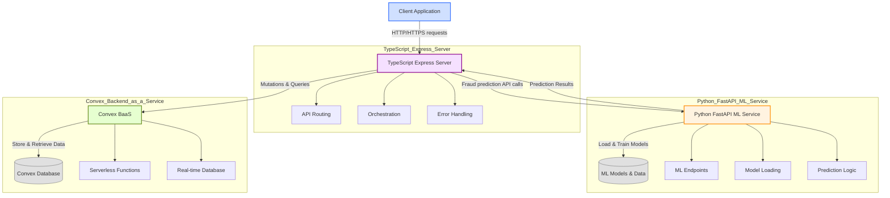
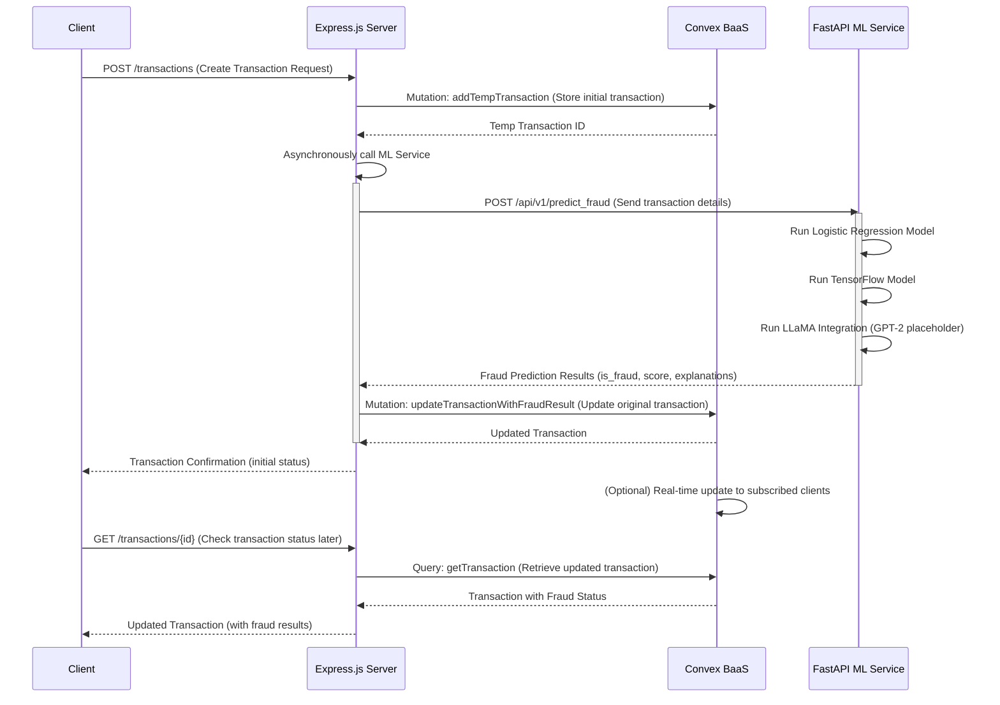

<!--
  Generated by AI-Powered README Generator
  Repository: https://github.com/WomB0ComB0/hackmit-2024-api
  Generated: 2025-11-21T09:53:27.551Z
  Format: md
  Style: comprehensive
-->

# HackMIT 2024 API - Advanced Fraud Detection and Transaction Management

<p align="center">
  <em>A robust, dual-stack backend for secure transaction processing with real-time, multi-model fraud detection.</em>
</p>

[](https://opensource.org/licenses/MIT)
[](https://www.python.org/)
[](https://www.typescriptlang.org/)
[](https://www.convex.dev/)
[](https://www.docker.com/)
[](https://github.com/WomB0ComB0/hackmit-2024-api/commits/main)

---

## 🚀 Table of Contents

Navigate through this documentation with ease:

-   [🌟 Overview / Introduction](#-overview--introduction)
-   [✨ Feature Highlights](#-feature-highlights)
-   [🏗️ Architecture & Design](#%EF%B8%8F-architecture--design)
    -   [High-Level Component Diagram](#high-level-component-diagram)
    -   [Architectural Components Explained](#architectural-components-explained)
    -   [Technology Stack](#technology-stack)
-   [📦 Getting Started: Installation & Setup](#-getting-started-installation--setup)
    -   [Prerequisites](#prerequisites)
    -   [Local Development Setup](#local-development-setup)
    -   [Configuration](#configuration)
    -   [Running the Application](#running-the-application)
-   [💡 Usage Guide & Workflows](#-usage-guide--workflows)
    -   [Transaction Processing Flow](#transaction-processing-flow)
    -   [API Endpoints & Examples](#api-endpoints--examples)
    -   [Common Use Cases](#common-use-cases)
-   [⚠️ Limitations, Known Issues & Future Roadmap](#%EF%B8%8F-limitations-known-issues--future-roadmap)
    -   [Current Limitations](#current-limitations)
    -   [Known Issues](#known-issues)
    -   [Future Roadmap & Enhancements](#future-roadmap--enhancements)
-   [🤝 Contributing & Development Guidelines](#-contributing--development-guidelines)
    -   [How to Contribute](#how-to-contribute)
    -   [Branching & Pull Request Guidelines](#branching--pull-request-guidelines)
    -   [Code Style, Testing & Linting](#code-style-testing--linting)
    -   [Development Environment Setup](#development-environment-setup)
-   [©️ License, Credits & Contact](#%EF%B8%8F-license-credits--contact)
    -   [License Information](#license-information)
    -   [Acknowledgments & Dependencies](#acknowledgments--dependencies)
    -   [Maintainer & Contact](#maintainer--contact)
-   [📚 Appendix](#-appendix)
    -   [Changelog](#changelog)
    -   [Frequently Asked Questions (FAQ)](#frequently-asked-questions-faq)
    -   [Troubleshooting Guide](#troubleshooting-guide)
    -   [API Reference](#api-reference)

---

## 🌟 Overview / Introduction

The **HackMIT 2024 API** is a sophisticated monorepo project designed to provide a robust backend infrastructure for managing user transactions and, critically, detecting potential fraudulent activities in real-time. Developed during HackMIT 2024, this solution showcases a powerful dual-stack approach, blending a Python-based FastAPI service for cutting-edge machine learning-driven fraud prediction with a TypeScript-based Express.js server for efficient API routing and seamless interaction with a Convex.dev Backend-as-a-Service (BaaS) for data persistence.

**Purpose & Goals:**
Our primary goal is to empower applications with the ability to handle financial transactions securely and intelligently. This system aims to:
-   Provide a scalable and reactive platform for transaction and user management.
-   Integrate advanced machine learning models for real-time fraud detection.
-   Offer clear, actionable insights into transaction legitimacy.
-   Simplify backend operations through a modern, serverless-first approach with Convex.dev.

**Why it Matters / Problem it Solves:**
In today's digital economy, financial fraud is a persistent and evolving threat. Traditional fraud detection methods often suffer from high false positive rates or delayed detection, leading to significant financial losses and eroded customer trust. This application addresses these challenges by:
-   **Minimizing Fraudulent Transactions:** Proactively identifying suspicious activities before they cause damage.
-   **Enhancing User Experience:** Providing a secure environment for transactions.
-   **Reducing Operational Overhead:** Automating fraud analysis and leveraging a managed BaaS for data.
-   **Enabling Rapid Development:** Using modern frameworks and microservices principles.

**Target Audience:**
This documentation is tailored for:
-   **Developers:** Integrating the API into web or mobile applications.
-   **Backend Engineers:** Deploying, maintaining, and scaling the services.
-   **Data Scientists:** Understanding the ML models and their integration.
-   **System Architects:** Evaluating the overall design and technology choices.

[⬆️ Back to Top](#-table-of-contents)

---

## ✨ Feature Highlights

This application is packed with features designed for comprehensive transaction management and intelligent fraud detection.

### Core Functionality
-   ✅ **User Management API**: Complete CRUD (Create, Retrieve, Update, Delete) endpoints for user records.
-   ✅ **Transaction Management API**: Comprehensive CRUD capabilities for handling financial transactions, including retrieval by ID, by user, or all transactions.
-   ✅ **Scalable Backend with Convex.dev**: Leverages Convex.dev for a reactive, serverless database and function platform, simplifying data synchronization and state management.

### Advanced Fraud Detection
-   🔍 **Real-time Multi-Model Fraud Prediction**: Integrates a suite of machine learning models to assess transaction legitimacy with high accuracy.
    -   **Logistic Regression**: A robust statistical model providing a baseline fraud probability.
    -   **TensorFlow Neural Network**: A deeper learning model for identifying more complex, non-linear fraud patterns.
    -   **LLaMA-based Analysis**: (Currently using a GPT-2 placeholder) Employs large language models for natural language understanding of transaction details, providing contextual insights and explanations into potential fraud.
-   💡 **Asynchronous Fraud Processing**: Transactions are initially stored, and fraud prediction runs in the background. The transaction status is updated once the ML analysis is complete, ensuring a smooth user experience without blocking.
-   🚀 **Extensible ML Pipeline**: Designed to easily integrate new machine learning models or update existing ones within the FastAPI service.

### Architectural & Deployment Advantages
-   🏗️ **Microservices-Inspired Architecture**: Decouples concerns into a TypeScript Express.js API gateway and a Python FastAPI ML service, enhancing scalability and maintainability.
-   🌐 **API Gateway/Orchestration**: The TypeScript Express server acts as a central orchestrator, handling incoming requests, interacting with Convex.dev, and intelligently delegating fraud prediction tasks to the Python FastAPI service.
-   🐳 **Dockerized Deployment**: Both the Python ML API and the TypeScript server are containerized, ensuring consistent, isolated, and reproducible deployments across different environments.
-   🛡️ **Robust Error Handling & Rate Limiting**: Implements comprehensive error handling across the Express.js server and API rate limiting for security, stability, and abuse prevention.

[⬆️ Back to Top](#-table-of-contents)

---

## 🏗️ Architecture & Design

The HackMIT 2024 API adopts a modern, microservices-inspired architecture designed for scalability, maintainability, and efficient real-time fraud detection. It's composed of three primary components working in concert.

### High-Level Component Diagram

This diagram illustrates the main services and their interactions:



### Architectural Components Explained

1.  **TypeScript Express.js Server (API Gateway & Orchestrator)**
    *   **Role**: This is the primary entry point for all client applications. It acts as an API gateway, handling all incoming HTTP requests for user and transaction management. It does **not** directly manage persistent data but orchestrates interactions with Convex.dev.
    *   **Responsibilities**:
        *   **Request Routing**: Directs API calls to appropriate Convex.dev functions for data operations.
        *   **Fraud Detection Orchestration**:
            *   Receives new transaction requests.
            *   Stores initial transaction data in a `tempTransactions` collection in Convex.
            *   Asynchronously calls the Python FastAPI service to perform fraud prediction.
            *   Once results are received from the ML service, updates the corresponding transaction in Convex with the fraud analysis outcomes.
        *   **Middleware**: Implements essential middleware for CORS, rate limiting, and centralized error handling to ensure security and stability.
    *   **Deployment**: Deployed as a Node.js application, typically containerized.

2.  **Python FastAPI Service (ML-driven Fraud Prediction)**
    *   **Role**: A dedicated microservice focused on performing complex machine learning inferences for fraud detection. It exposes a single, high-performance endpoint for prediction requests.
    *   **Responsibilities**:
        *   **ML Endpoint**: Provides `/api/v1/predict_fraud` endpoint which accepts transaction data.
        *   **Multi-Model Inference**: Integrates and runs predictions using multiple trained models:
            *   **Logistic Regression**: A fast, interpretable baseline.
            *   **TensorFlow Model**: A more powerful neural network for sophisticated pattern detection.
            *   **LLaMA Integration**: (Currently a placeholder using GPT-2) Processes transaction descriptions using NLP to add contextual fraud indicators and explanations.
        *   **Model Management**: Loads pre-trained `.joblib` and TensorFlow models.
        *   **Data Preprocessing**: Handles any necessary preprocessing of incoming transaction data before feeding it to the models.
    *   **Deployment**: Deployed as a Python FastAPI application, containerized with Docker. It's designed to be stateless (per request) and horizontally scalable.

3.  **Convex.dev (Backend as a Service - BaaS)**
    *   **Role**: A reactive, serverless database and function platform that serves as the single source of truth for all persistent data (users, transactions).
    *   **Responsibilities**:
        *   **Real-time Database**: Manages `users`, `transactions`, and `tempTransactions` collections. It's a document-oriented database with real-time capabilities.
        *   **Server-Side Functions (Mutations & Queries)**: Hosts the backend logic that interacts directly with the database, defined in TypeScript. This includes functions for creating, reading, updating, and deleting users and transactions. These functions are called by the TypeScript Express server.
        *   **Data Synchronization**: Offers real-time data updates, enabling connected clients to automatically receive fresh data.
    *   **Deployment**: A fully managed cloud service; developers interact with it via its CLI and client libraries.

### Technology Stack

The project leverages a diverse and modern technology stack:

#### Python FastAPI Service:
-   **Language**: Python 3.9+
-   **Web Framework**: [FastAPI](https://fastapi.tiangolo.com/) (for high-performance API development)
-   **Machine Learning**:
    -   [`scikit-learn`](https://scikit-learn.org/): For Logistic Regression model.
    -   [`tensorflow`](https://www.tensorflow.org/): For deep learning models.
    -   [`torch`](https://pytorch.org/) & [`transformers`](https://huggingface.co/docs/transformers/): For integrating large language models (LLaMA placeholder with GPT-2).
    -   [`numpy`](https://numpy.org/) & [`pandas`](https://pandas.pydata.org/): For data manipulation and numerical operations.
-   **Data Serialization**: [`Pydantic`](https://pydantic-docs.helpmanual.io/) (integrated with FastAPI for data validation).
-   **HTTP Client**: `httpx` (for internal testing).
-   **Containerization**: [Docker](https://www.docker.com/).
-   **Linting/Formatting**: [`pylint`](https://pylint.pycqa.org/en/latest/).

#### TypeScript Express.js Server:
-   **Language**: [TypeScript](https://www.typescriptlang.org/) (for type safety and enhanced developer experience).
-   **Runtime**: [Node.js](https://nodejs.org/) (v18+).
-   **Web Framework**: [Express.js](https://expressjs.com/) (for robust API development).
-   **Backend as a Service (BaaS)**: [Convex.dev](https://www.convex.dev/) (for real-time database and serverless functions).
-   **HTTP Client**: [`axios`](https://axios-http.com/) / native `fetch` (for communicating with FastAPI service).
-   **Security**:
    -   [`express-rate-limit`](https://www.npmjs.com/package/express-rate-limit): For API rate limiting.
    -   [`cors`](https://www.npmjs.com/package/cors): For Cross-Origin Resource Sharing.
    -   [`bcrypt`](https://www.npmjs.com/package/bcrypt): (Present in `package.json`, typically for password hashing, though not explicitly used in core transaction flow).
-   **Testing**: [`vitest`](https://vitest.dev/).
-   **Linting/Formatting**: [`@biomejs/biome`](https://biomejs.dev/).
-   **Development Tools**: `nodemon`, `ts-node`.
-   **Containerization**: [Docker](https://www.docker.com/).

[⬆️ Back to Top](#-table-of-contents)

---

## 📦 Getting Started: Installation & Setup

Follow these steps to get the HackMIT 2024 API up and running on your local machine.

### Prerequisites

Ensure you have the following software installed with the specified versions:

-   **Node.js**: v18.x or higher (LTS recommended)
    -   Verify with: `node -v`
-   **npm**: v9.x or higher
    -   Verify with: `npm -v`
-   **Python**: v3.9 or higher
    -   Verify with: `python3 --version` (or `python --version` depending on your setup)
-   **pip**: Latest version
    -   Verify with: `pip3 --version` (or `pip --version`)
-   **Docker** (Optional, but highly recommended for consistent deployments):
    -   [Docker Desktop](https://www.docker.com/products/docker-desktop)
    -   Verify with: `docker --version`
-   **Convex CLI**:
    -   Install globally: `npm i -g convex`
    -   Verify with: `convex --version`

### Local Development Setup

1.  **Clone the Repository:**
    ```bash
    git clone https://github.com/WomB0ComB0/hackmit-2024-api.git
    cd hackmit-2024-api
    ```

2.  **Setup Python FastAPI Service (`api` directory):**
    This service hosts the machine learning models.

    ```bash
    cd api
    # Create and activate a Python virtual environment (highly recommended)
    python3 -m venv venv
    source venv/bin/activate # On Windows: .\venv\Scripts\activate
    
    # Install Python dependencies
    pip install -r requirements.txt
    
    # Generate mock training data (if not already present or if you want fresh data)
    # This script will create/update `X_train.csv` and `y_train.csv` in `api/data/`
    python app/services/mock_data_generator.py 
    
    # Train the ML models (this will generate .joblib and .h5 files)
    # This might take a moment as it trains Logistic Regression and TensorFlow models
    python app/ml/logistic_regression.py # Trains and saves logistic_regression_model.joblib
    python app/ml/tf_model.py            # Trains and saves tf_model.h5
    
    cd .. # Return to the monorepo root
    ```

3.  **Setup TypeScript Express.js Server (`server` directory) and Convex:**
    This service is the API gateway and interacts with Convex.dev.

    ```bash
    cd server
    # Install Node.js dependencies
    npm install
    
    # Login to Convex (if you haven't already). This will open a browser window.
    convex login
    
    # Initialize a new Convex project or link to an existing one.
    # If you're starting fresh, follow prompts to create a new project.
    # If linking to an existing one, make sure your Convex project is empty or compatible.
    convex init
    
    # Deploy your Convex schema and functions. This will create your database collections.
    # IMPORTANT: Ensure your Convex project is selected correctly after `convex init`.
    convex deploy
    
    cd .. # Return to the monorepo root
    ```

### Configuration

Both services require environment variables for proper operation.

#### 1. FastAPI Service (`api/.env`):
Create a `.env` file in the `api/` directory with the following content. Replace placeholders with appropriate values.

```env
# api/.env

# The port the FastAPI service will listen on
API_PORT=8000

# Base directory for ML models and data
ML_MODEL_BASE_DIR=./app/ml
ML_DATA_BASE_DIR=./data

# Model names
LOGISTIC_REGRESSION_MODEL_FILE=fraud_detection_model.joblib
TENSORFLOW_MODEL_FILE=tf_model.h5
```

#### 2. Express.js Server (`server/.env`):
Create a `.env` file in the `server/` directory.

```env
# server/.env

# The port the Express.js server will listen on
PORT=3000

# URL of the Python FastAPI ML service
# If running locally, this should point to your FastAPI instance
FASTAPI_ML_SERVICE_URL=http://localhost:8000 

# Convex Deployment URL (usually obtained from `convex status` or Convex dashboard)
# This is typically automatically configured by `convex init` and `convex deploy`
# but might need to be set manually for production environments.
# Example: CONVEX_DEPLOYMENT_URL=https://<your-project-name>.convex.cloud
CONVEX_DEPLOYMENT_URL=

# You might need to add this for Vercel deployment if not picked up automatically
VERCEL_ENV=development
```

<details>
<summary>💡 **Tip: Getting `CONVEX_DEPLOYMENT_URL`**</summary>
After running `convex deploy`, you can find your deployment URL in the Convex dashboard or by running `convex status` in your `server/` directory. It usually looks like `https://<your-unique-id>.convex.cloud`. Ensure this is correctly set in `server/.env`.
</details>

### Running the Application

You can run the application services individually in development mode or use Docker Compose for a production-like environment.

#### 1. Running in Development Mode (Recommended for Local Dev)

Open two separate terminal windows.

**Terminal 1: Run Python FastAPI ML Service**
```bash
cd hackmit-2024-api/api
source venv/bin/activate # Activate virtual environment
uvicorn main:app --host 0.0.0.0 --port 8000 --reload
```
The FastAPI service will be accessible at `http://localhost:8000`.

**Terminal 2: Run TypeScript Express.js Server**
```bash
cd hackmit-2024-api/server
npm run dev
```
The Express.js server will be accessible at `http://localhost:3000`.

#### 2. Running with Docker Compose (Production-like Environment)

Ensure Docker Desktop is running. This method will build and run both services in containers.

```bash
cd hackmit-2024-api
docker-compose up --build
```
-   The Express.js server will be available at `http://localhost:3000`.
-   The FastAPI ML service will be internally available to the Express.js server.
-   Make sure your `server/.env` `FASTAPI_ML_SERVICE_URL` is set to `http://api:8000` when using Docker Compose (where `api` is the service name defined in `docker-compose.yml`). For local dev without Docker Compose, it should be `http://localhost:8000`.

<details>
<summary>⚠️ **Important: Docker Compose Environment Configuration**</summary>
When using Docker Compose, the `FASTAPI_ML_SERVICE_URL` in `server/.env` needs to refer to the Docker internal service name. If your `docker-compose.yml` defines the FastAPI service as `api` (which is common), then `FASTAPI_ML_SERVICE_URL` should be `http://api:8000`. For Convex, ensure `CONVEX_DEPLOYMENT_URL` is correctly configured in `server/.env`.
</details>

[⬆️ Back to Top](#-table-of-contents)

---

## 💡 Usage Guide & Workflows

This section guides you through common usage scenarios and provides example API interactions.

### Transaction Processing Flow

Understanding the flow of a transaction, especially with fraud detection, is crucial:



### API Endpoints & Examples

The primary interaction point is the Express.js server (typically running on `http://localhost:3000`).

#### 1. User Management

<details>
<summary>📚 **Create a New User**</summary>

**Endpoint:** `POST /users`
**Description:** Registers a new user in the system.
**Request Body:**
```json
{
  "username": "john.doe",
  "email": "john.doe@example.com",
  "name": "John Doe"
}
```
**Example `curl` command:**
```bash
curl -X POST http://localhost:3000/users \
     -H "Content-Type: application/json" \
     -d '{
           "username": "john.doe",
           "email": "john.doe@example.com",
           "name": "John Doe"
         }'
```
**Expected Response (201 Created):**
```json
{
  "_id": "0123abc...",
  "_creationTime": 1701234567890,
  "username": "john.doe",
  "email": "john.doe@example.com",
  "name": "John Doe"
}
```
</details>

<details>
<summary>📚 **Get All Users**</summary>

**Endpoint:** `GET /users`
**Description:** Retrieves a list of all registered users.
**Example `curl` command:**
```bash
curl http://localhost:3000/users
```
**Expected Response (200 OK):**
```json
[
  {
    "_id": "0123abc...",
    "_creationTime": 1701234567890,
    "username": "john.doe",
    "email": "john.doe@example.com",
    "name": "John Doe"
  },
  {
    "_id": "4567def...",
    "_creationTime": 1701234567900,
    "username": "jane.smith",
    "email": "jane.smith@example.com",
    "name": "Jane Smith"
  }
]
```
</details>

<details>
<summary>📚 **Get User by ID**</summary>

**Endpoint:** `GET /users/:userId`
**Description:** Retrieves a single user by their unique ID.
**Example `curl` command:**
```bash
curl http://localhost:3000/users/0123abc... # Replace with actual user ID
```
**Expected Response (200 OK):**
```json
{
  "_id": "0123abc...",
  "_creationTime": 1701234567890,
  "username": "john.doe",
  "email": "john.doe@example.com",
  "name": "John Doe"
}
```
</details>

#### 2. Transaction Management & Fraud Detection

<details>
<summary>📚 **Create a New Transaction (with Fraud Detection)**</summary>

**Endpoint:** `POST /transactions`
**Description:** Initiates a new transaction. The Express.js server will store it temporarily, then send it to the FastAPI ML service for fraud prediction, and finally update its status in Convex.
**Request Body:**
```json
{
  "userId": "0123abc...",         # ID of the user performing the transaction
  "amount": 150.75,
  "currency": "USD",
  "description": "Online purchase at Acme Store",
  "merchantId": "MERCH-ACME-001",
  "cardType": "Visa",
  "location": "New York, NY"
}
```
**Example `curl` command:**
```bash
curl -X POST http://localhost:3000/transactions \
     -H "Content-Type: application/json" \
     -d '{
           "userId": "0123abc...", 
           "amount": 150.75,
           "currency": "USD",
           "description": "Online purchase at Acme Store",
           "merchantId": "MERCH-ACME-001",
           "cardType": "Visa",
           "location": "New York, NY"
         }'
```
**Expected Response (201 Created - initial status):**
```json
{
  "_id": "0123xyz...",
  "_creationTime": 1701234600000,
  "userId": "0123abc...",
  "amount": 150.75,
  "currency": "USD",
  "description": "Online purchase at Acme Store",
  "merchantId": "MERCH-ACME-001",
  "cardType": "Visa",
  "location": "New York, NY",
  "status": "pending_fraud_check",
  "isFraud": null,
  "fraudScore": null,
  "fraudExplanation": null
}
```
<br>
<p>💡 **Note:** The `isFraud`, `fraudScore`, and `fraudExplanation` fields will be `null` initially. They will be updated asynchronously by the Express.js server after receiving results from the ML service.</p>
</details>

<details>
<summary>📚 **Get Transaction by ID (with Fraud Status)**</summary>

**Endpoint:** `GET /transactions/:transactionId`
**Description:** Retrieves a single transaction, including its updated fraud detection status.
**Example `curl` command:**
```bash
curl http://localhost:3000/transactions/0123xyz... # Replace with actual transaction ID
```
**Expected Response (200 OK - after fraud check completes):**
```json
{
  "_id": "0123xyz...",
  "_creationTime": 1701234600000,
  "userId": "0123abc...",
  "amount": 150.75,
  "currency": "USD",
  "description": "Online purchase at Acme Store",
  "merchantId": "MERCH-ACME-001",
  "cardType": "Visa",
  "location": "New York, NY",
  "status": "completed", # Or "flagged_fraud"
  "isFraud": false,     # Or true
  "fraudScore": 0.05,   # Or higher, e.g., 0.92
  "fraudExplanation": "Low risk based on transaction history and merchant reputation."
                        # Or "High risk due to unusual location and large amount for new user."
}
```
</details>

<details>
<summary>📚 **Get All Transactions or Transactions by User**</summary>

**Endpoint:** `GET /transactions`
**Description:** Retrieves all transactions in the system.
**Example `curl` command:**
```bash
curl http://localhost:3000/transactions
```

**Endpoint:** `GET /transactions?userId=:userId`
**Description:** Retrieves all transactions for a specific user.
**Example `curl` command:**
```bash
curl http://localhost:3000/transactions?userId=0123abc...
```

**Expected Response (200 OK):**
```json
[
  {
    "_id": "0123xyz...",
    "...": "...",
    "isFraud": false,
    "fraudScore": 0.05,
    "fraudExplanation": "Low risk..."
  },
  {
    "_id": "abc456...",
    "...": "...",
    "isFraud": true,
    "fraudScore": 0.92,
    "fraudExplanation": "High risk due to unusual pattern..."
  }
]
```
</details>

### Common Use Cases

-   **E-commerce Platforms**: Automatically screen incoming orders for potential fraud before fulfillment.
-   **Fintech Applications**: Monitor peer-to-peer transfers, loan applications, or cryptocurrency transactions for suspicious activity.
-   **Banking Systems**: Flag unusual credit card charges or withdrawal patterns.
-   **Subscription Services**: Detect fraudulent sign-ups or payment methods.

[⬆️ Back to Top](#-table-of-contents)

---

## ⚠️ Limitations, Known Issues & Future Roadmap

Every project has its current state and future aspirations. Here's what to keep in mind.

### Current Limitations

-   **ML Model Training Data**: The ML models are currently trained on synthetic/mock data generated by `mock_data_generator.py`. While useful for demonstration, real-world performance requires training on extensive, diverse, and representative real-world transaction datasets.
-   **LLaMA Integration Placeholder**: The LLaMA integration currently uses a fine-tuned GPT-2 model (via `transformers`) as a placeholder. Implementing a true LLaMA (or similar large model) would require significant computational resources and specific model serving infrastructure not fully integrated in this current setup. The goal is to demonstrate the *capability* of such integration.
-   **No Robust User Authentication**: The Express.js server currently lacks robust user authentication (e.g., JWT, OAuth). Users are identified by their Convex `_id` and assumed to be authenticated by a layer external to this API.
-   **Limited Error Handling in ML Service**: While the Express.js server has comprehensive error handling, the FastAPI service's error handling for ML inference failures could be more granular (e.g., specific error codes for model loading failure vs. prediction failure).
-   **No Background Task Queue for ML Calls**: The asynchronous call to the ML service from Express.js is a direct HTTP call. For high-volume production, integrating a dedicated message queue (e.g., Celery with Redis, RabbitMQ, Kafka) would make fraud prediction truly decoupled and resilient to ML service downtime.
-   **Simplified Feature Engineering**: The features used for ML models are basic transaction attributes. Advanced fraud detection often requires complex feature engineering, including behavioral analytics, temporal features, and graph-based features.

### Known Issues

-   **Initial ML Inference Latency**: Upon first request to the FastAPI ML service after deployment or a period of inactivity, model loading might introduce a slight delay. This is mitigated by subsequent requests due to caching, but "cold starts" can occur.
-   **Convex Rate Limits**: For very high-volume transaction creation, you might encounter Convex rate limiting if not configured with a sufficiently high plan or optimized Convex functions.
-   **Model Versioning**: Currently, there's no explicit model versioning or A/B testing framework in place. Deploying new models requires manual replacement of files.

### Future Roadmap & Enhancements

We are continuously looking to improve the HackMIT 2024 API with the following planned enhancements:

-   **Integration of Real LLaMA/Generative AI**: Implement proper integration with actual LLaMA models or other state-of-the-art LLMs (e.g., OpenAI, Anthropic) for more sophisticated contextual fraud analysis and explanation generation.
-   **Advanced Machine Learning Models**: Explore and integrate more complex models like Isolation Forests, XGBoost, or Graph Neural Networks for enhanced fraud detection accuracy.
-   **Comprehensive User Authentication & Authorization**: Implement full user authentication (e.g., using JWTs) and role-based access control (RBAC) within the Express.js server.
-   **Message Queue Integration**: Introduce a message queue (e.g., Kafka, RabbitMQ, Redis Streams) for asynchronous fraud prediction requests, making the system more robust, scalable, and resilient.
-   **Real-time Feature Store**: Develop or integrate with a feature store to manage and serve ML features consistently across training and inference, potentially reducing latency.
-   **Monitoring & Alerting**: Implement comprehensive monitoring (e.g., Prometheus, Grafana) for both services, including API latency, error rates, and ML model performance metrics. Set up alerts for anomalies.
-   **Automated ML Pipeline (MLOps)**: Automate model retraining, versioning, and deployment using MLOps tools (e.g., MLflow, Kubeflow).
-   **API Documentation**: Generate OpenAPI/Swagger documentation for the Express.js endpoints.
-   **Test Coverage Expansion**: Increase unit and integration test coverage for both Python and TypeScript services.
-   **Dashboard/Admin UI**: Develop a simple web UI for viewing transactions, fraud flags, and managing users.

[⬆️ Back to Top](#-table-of-contents)

---

## 🤝 Contributing & Development Guidelines

We welcome contributions from the community! Whether it's reporting bugs, suggesting features, or submitting code, your help is appreciated.

### How to Contribute

1.  **Fork the Repository**: Start by forking the `WomB0ComB0/hackmit-2024-api` repository to your GitHub account.
2.  **Clone Your Fork**: Clone your forked repository to your local machine:
    ```bash
    git clone https://github.com/YOUR_USERNAME/hackmit-2024-api.git
    cd hackmit-2024-api
    ```
3.  **Create a New Branch**: Create a descriptive branch for your feature or bug fix:
    ```bash
    git checkout -b feature/your-feature-name # For new features
    git checkout -b bugfix/issue-description   # For bug fixes
    ```
4.  **Make Your Changes**: Implement your changes, following the [Code Style, Testing & Linting](#code-style-testing--linting) guidelines.
5.  **Test Your Changes**: Ensure your changes don't introduce regressions and ideally include new tests for new features.
6.  **Commit Your Changes**: Write clear, concise commit messages.
    ```bash
    git commit -m "feat: Add new transaction status for fraud review"
    git commit -m "fix: Resolve issue with incorrect fraud score calculation"
    ```
7.  **Push to Your Fork**:
    ```bash
    git push origin feature/your-feature-name
    ```
8.  **Create a Pull Request**: Go to the original `WomB0ComB0/hackmit-2024-api` repository on GitHub and open a new Pull Request from your branch. Provide a detailed description of your changes.

### Branching & Pull Request Guidelines

-   **Branch Naming**: Use `feature/`, `bugfix/`, `docs/`, `chore/` prefixes (e.g., `feature/add-user-auth`, `bugfix/transaction-amount-validation`).
-   **Commit Messages**: Follow [Conventional Commits](https://www.conventionalcommits.org/en/v1.0.0/) for clear history (e.g., `feat: (server) Add new endpoint for X`, `fix: (api) Correct model loading path`).
-   **Pull Requests**:
    -   Link to any relevant issues.
    -   Provide a clear summary of changes and their purpose.
    -   Include steps to test your changes.
    -   Ensure your branch is up-to-date with `main` before submitting.

### Code Style, Testing & Linting

Maintaining a consistent code style and ensuring code quality is paramount.

#### TypeScript (Express.js Server)
-   **Linter/Formatter**: [`Biome`](https://biomejs.dev/) is used for TypeScript code.
    -   Run formatter: `npm run format` (from `server/` directory)
    -   Run linter: `npm run lint` (from `server/` directory)
    -   Pre-commit hooks or IDE integration with Biome is highly recommended.
-   **Testing**: [`Vitest`](https://vitest.dev/) is used for unit and integration tests.
    -   Run tests: `npm test` (from `server/` directory)
    -   Write tests for new features and bug fixes.

#### Python (FastAPI ML Service)
-   **Linter**: [`Pylint`](https://pylint.pycqa.org/en/latest/) is configured (see `api/.pylintrc`).
    -   Run linter: `pylint api/app` (from `api/` directory after activating venv)
-   **Formatter**: [`Black`](https://github.com/psf/black) is recommended (though not explicitly configured in `package.json`).
    -   Run formatter: `black api/app`
-   **Testing**: [`pytest`](https://docs.pytest.org/en/stable/) is used for unit and integration tests.
    -   Run tests: `pytest` (from `api/` directory after activating venv)

### Development Environment Setup

Refer to the [Local Development Setup](#local-development-setup) section for detailed instructions on getting your environment ready. Ensure all prerequisites are met and dependencies installed for both the `api` and `server` directories.

[⬆️ Back to Top](#-table-of-contents)

---

## ©️ License, Credits & Contact

### License Information

This project is licensed under the **MIT License**. You are free to use, modify, and distribute this software, subject to the conditions outlined in the license.

A copy of the MIT License can be found in the `server/LICENSE` file.

```
MIT License

Copyright (c) 2024 WomB0ComB0

Permission is hereby granted, free of charge, to any person obtaining a copy
of this software and associated documentation files (the "Software"), to deal
in the Software without restriction, including without limitation the rights
to use, copy, modify, merge, publish, distribute, sublicense, and/or sell
copies of the Software, and to permit persons to whom the Software is
furnished to do so, subject to the following conditions:

The above copyright notice and this permission notice shall be included in all
copies or substantial portions of the Software.

THE SOFTWARE IS PROVIDED "AS IS", WITHOUT WARRANTY OF ANY KIND, EXPRESS OR
IMPLIED, INCLUDING BUT NOT LIMITED TO THE WARRANTIES OF MERCHANTABILITY,
FITNESS FOR A PARTICULAR PURPOSE AND NONINFRINGEMENT. IN NO EVENT SHALL THE
AUTHORS OR COPYRIGHT HOLDERS BE LIABLE FOR ANY CLAIM, DAMAGES OR OTHER
LIABILITY, WHETHER IN AN ACTION OF CONTRACT, TORT OR OTHERWISE, ARISING FROM,
OUT OF OR IN CONNECTION WITH THE SOFTWARE OR THE USE OR OTHER DEALINGS IN THE
SOFTWARE.
```

### Acknowledgments & Dependencies

We extend our gratitude to the creators and maintainers of the following open-source projects and platforms, which make this application possible:

-   **Convex.dev**: For providing a powerful and reactive Backend-as-a-Service.
-   **FastAPI**: For enabling rapid development of high-performance Python APIs.
-   **Express.js**: For a flexible and robust Node.js web framework.
-   **Scikit-learn**: For foundational machine learning algorithms.
-   **TensorFlow**: For deep learning capabilities.
-   **Hugging Face Transformers**: For simplifying the integration of large language models.
-   **Node.js**: For the JavaScript runtime.
-   **Python**: For the versatile programming language.
-   **Docker**: For containerization and consistent environments.
-   **BiomeJS**: For fast and comprehensive code quality tooling.
-   **Vitest**: For a delightful and fast testing experience.
-   **Pytest**: For robust Python testing.
-   **Pydantic**: For data validation and settings management.
-   **Uvicorn**: For the ASGI server for FastAPI.

### Maintainer & Contact

This project is primarily maintained by:

-   **WomB0ComB0**
    -   GitHub: [@WomB0ComB0](https://github.com/WomB0ComB0)

For general inquiries, bug reports, or feature requests, please open an issue on the [GitHub repository](https://github.com/WomB0ComB0/hackmit-2024-api/issues).

[⬆️ Back to Top](#-table-of-contents)

---

## 📚 Appendix

### Changelog

#### Version 0.1.0 - Initial Release (HackMIT 2024)
-   Dual-stack architecture (Python FastAPI ML + TypeScript Express + Convex BaaS).
-   User and transaction management APIs.
-   Integrated Logistic Regression, TensorFlow, and placeholder LLaMA fraud detection.
-   Asynchronous fraud prediction workflow.
-   Dockerized services.
-   Basic error handling and rate limiting.

### Frequently Asked Questions (FAQ)

<details>
<summary>Q: How does the fraud detection work?</summary>
A: When a new transaction is created via the Express.js API, it's immediately stored in Convex with a `pending_fraud_check` status. The Express.js server then calls the Python FastAPI ML service with the transaction details. The ML service runs the data through multiple models (Logistic Regression, TensorFlow, and a language model for contextual analysis), generates a fraud score and explanation, and returns these to the Express.js server. Finally, the Express.js server updates the original transaction in Convex with the fraud assessment.
</details>

<details>
<summary>Q: What machine learning models are used?</summary>
A: Currently, the system uses three types of models:
1.  **Logistic Regression**: A simple, fast, and interpretable model for baseline fraud probability.
2.  **TensorFlow Model**: A more complex neural network for detecting intricate patterns.
3.  **LLaMA Integration**: (Currently a GPT-2 placeholder) Utilizes a transformer-based language model to analyze the transaction `description` for contextual fraud indicators and generate explanations.
</details>

<details>
<summary>Q: Can I use my own ML models?</summary>
A: Yes! The Python FastAPI service is designed to be extensible. You can replace the existing `fraud_detection_model.joblib` and `tf_model.h5` with your own trained models, or add new model inference logic within the `api/app/ml/` directory and integrate them into the `predict_fraud` endpoint in `api/app/routers/transactions.py`. Ensure your models are trained on data compatible with the expected input schema.
</details>

<details>
<summary>Q: How do I manage my Convex database?</summary>
A: You can interact with your Convex database using the `convex` CLI (`npm i -g convex`) or through the Convex dashboard in your web browser. The schema is defined in `server/convex/schema.ts` and functions (queries/mutations) are in `server/convex/users.ts` and `server/convex/transactions.ts`. Changes to these files are deployed using `convex deploy`.
</details>

<details>
<summary>Q: What if the ML service is down?</summary>
A: If the ML service is unreachable, the Express.js server will likely log an error and the transaction's fraud status will remain `pending_fraud_check` or it might be marked with a specific error status, depending on the error handling implementation. In a production scenario, this highlights the need for a robust message queue to retry ML inference calls.
</details>

### Troubleshooting Guide

<details>
<summary>❌ **"Address already in use" error**</summary>
**Issue:** When starting the Express.js server or FastAPI service, you might see an error indicating the port is already in use.
**Solution:**
1.  Ensure you don't have another instance of the application running.
2.  Check for other processes using the same port:
    *   **Linux/macOS:** `sudo lsof -i :3000` (for Express.js) or `sudo lsof -i :8000` (for FastAPI). Then `kill -9 <PID>`.
    *   **Windows:** `netstat -ano | findstr :3000` (or :8000). Then `taskkill /PID <PID> /F`.
3.  Alternatively, change the `PORT` (for Express.js) or `API_PORT` (for FastAPI) in their respective `.env` files.
</details>

<details>
<summary>❌ **Convex deployment issues (e.g., "Cannot find Convex project")**</summary>
**Issue:** `convex deploy` fails, or the server cannot connect to Convex.
**Solution:**
1.  Ensure you've run `convex login` successfully.
2.  Make sure you ran `convex init` in the `server/` directory and selected/created the correct Convex project.
3.  Verify that your `CONVEX_DEPLOYMENT_URL` in `server/.env` is correct. You can find it in the Convex dashboard or by running `convex status` in the `server/` directory.
4.  Check your internet connection, as Convex requires network access.
</details>

<details>
<summary>❌ **FastAPI ML service `ModuleNotFoundError` or model loading errors**</summary>
**Issue:** The Python service fails to start or process requests due to missing packages or inability to load ML models.
**Solution:**
1.  **Virtual Environment:** Ensure your Python virtual environment is activated (`source venv/bin/activate`) before installing dependencies and running the service.
2.  **Dependencies:** Run `pip install -r requirements.txt` again to ensure all packages are installed.
3.  **Model Files:** Verify that the `mock_data_generator.py`, `logistic_regression.py`, and `tf_model.py` scripts were run successfully from the `api/` directory, and that `app/ml/fraud_detection_model.joblib` and `app/ml/tf_model.h5` exist.
4.  **Paths:** Double-check `api/.env` for correct `ML_MODEL_BASE_DIR` and model filenames.
</details>

<details>
<summary>❌ **Express.js server cannot connect to FastAPI ML service (HTTP 500 or network error)**</summary>
**Issue:** When creating a transaction, the Express.js server returns an error related to the ML service.
**Solution:**
1.  **FastAPI Running:** Ensure the Python FastAPI service is running and accessible at the URL specified in `server/.env` (`FASTAPI_ML_SERVICE_URL`).
2.  **`FASTAPI_ML_SERVICE_URL`:**
    *   **Local Dev:** If running both services locally without Docker Compose, it should be `http://localhost:8000`.
    *   **Docker Compose:** If using `docker-compose up`, it should be `http://api:8000` (assuming `api` is your FastAPI service name in `docker-compose.yml`).
    *   **Port Forwarding/Firewall:** Check if any firewall rules are blocking communication between the two services or from your local machine to the FastAPI port.
</details>

### API Reference

This project currently doesn't provide an automatically generated OpenAPI/Swagger UI. However, you can find the endpoint definitions in the following files:

-   **Express.js Server (TypeScript):**
    -   `server/routes/index.ts` (Entry point for API routes)
    -   `server/convex/users.ts` (Convex functions for user operations)
    -   `server/convex/transactions.ts` (Convex functions for transaction operations)
    -   (Note: Actual Express routes that call Convex functions are implicitly defined in `server/server.ts` through direct calls to Convex client or inferred from Convex HTTP actions if any were setup in `server/convex/http.ts`)

-   **FastAPI ML Service (Python):**
    -   `api/app/routers/transactions.py` (Defines the `/predict_fraud` endpoint)

For a more interactive exploration, consider using tools like [Postman](https://www.postman.com/) or [Insomnia](https://insomnia.rest/) with the example `curl` commands provided in the [Usage Guide](#-usage-guide--workflows).

[⬆️ Back to Top](#-table-of-contents)
